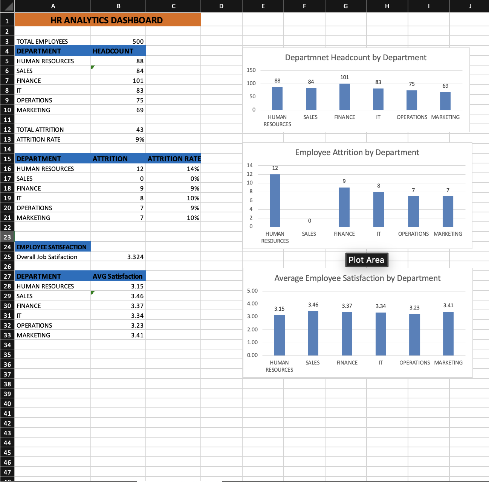

# HR Analytics Dashboard – Project 1

## Project Overview
An HR analytics project analyzing employee demographics, departmental headcount, attrition, and job satisfaction using Microsoft Excel.

## Objectives
- Analyze employee distribution across departments.
- Calculate employee attrition and attrition rates.
- Compare average employee satisfaction across departments.
- Present HR metrics using charts and visualizations.

## Tools Used
- Microsoft Excel
- Excel formulas and functions
- Data visualization
- HR metrics and KPIs

## Key Metrics
- Total Employees: 500
- Total Attrition: 43
- Overall Attrition Rate: 9%
- Overall Job Satisfaction: 3.324

## Dashboard Visualizations
1. Department Headcount
2. Employee Attrition by Department
3. Average Employee Satisfaction by Department

## Project File
[HR Analytics Dashboard Excel File](HR_Analytics_dashboard_project_1.xlsx)

## Author
Daksh Sheth

## Dashboard Preview

## Key Insights

### 1. Employee Distribution
- The organization has 500 employees across six departments.
- Finance has the highest headcount with 101 employees.
- Marketing has the lowest headcount with 69 employees.

### 2. Employee Attrition
- Total employee attrition is 43 employees.
- The overall attrition rate is approximately 9%.
- Human Resources has the highest departmental attrition rate at approximately 14%.
- Sales recorded zero attrition in the analyzed dataset.
- Finance recorded 9 employee exits.

### 3. Employee Satisfaction
- The overall job satisfaction score is 3.324.
- Sales has the highest average satisfaction score at 3.46.
- Operations has the lowest average satisfaction score at 3.23.
- Human Resources has an average satisfaction score of 3.15.

## Conclusion

The HR Analytics Dashboard provides an overview of employee demographics, departmental headcount, employee attrition, and job satisfaction.

The analysis identifies differences in attrition and satisfaction across departments. Human Resources has the highest departmental attrition rate, while Operations has the lowest average satisfaction score.

These findings can help HR professionals identify areas for further investigation, support employee engagement initiatives, and make data-informed workforce decisions.

This project demonstrates the practical application of Microsoft Excel, HR metrics, formulas, and data visualization in workforce analysis.
